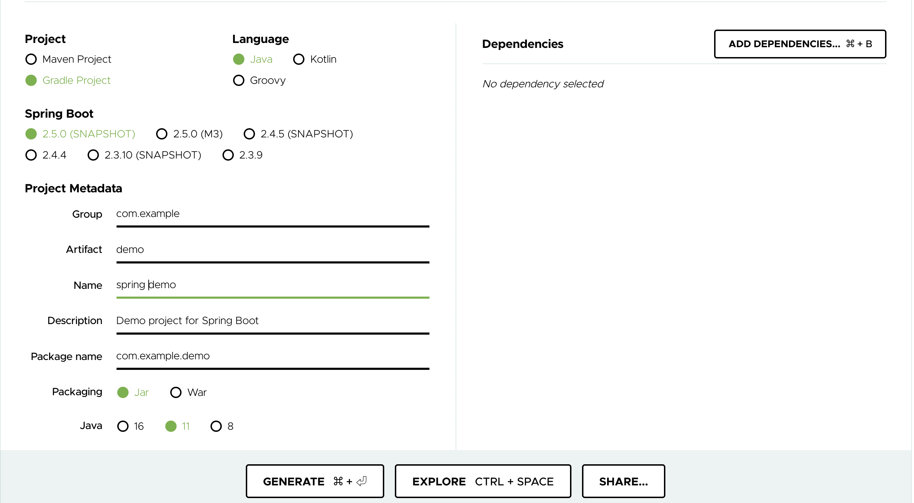

# Spring Boot


# メモ

以下でソースコードを作成 (2021/03/24)
https://start.spring.io/
---> これで demo.zip を作成

https://spring.io/guides/gs/spring-boot/



## 実際にやってみる

```
cd 70_flamework/springboot
```

+ Create Docker image

```
docker build . --tag my-spring-boot
```

+ Lunch and Login Docker Container

```
docker run -d  -p 8080:8080 --name my-spring-boot my-spring-boot
```

+ コンテナが起動しているか確認する

```
docker ps
```

+ Web ブラウザで確認する

```
0.0.0.0:8080
```

## デバック

仮にうまく行かない場合は以下のようにしてデバックする

1. Dockerfile で `Web Container` の項目をコメントアウト

```
# ### Web Container
# FROM adoptopenjdk:${_TAG}
# COPY --from=builder /usr/local/src/build/libs/demo-0.0.1-SNAPSHOT.jar /usr/local/src
# ENTRYPOINT [ "java", "-jar", "/usr/local/src/demo-0.0.1-SNAPSHOT.jar" ]
```

2. コンテナの build

```
docker build . --tag my-spring-boot
```

3. ローカルをコンテナにマウントして起動する

```
docker run -it --rm -v $(pwd)/demo:/data/ -w /data -p 8080:8080 --name my-spring-boot my-spring-boot /bin/bash
```

+ :whale: コンテナ内で bootrun する

```
./gradlew bootRun
```

+ Web ブラウザで確認する

```
0.0.0.0:8080
```

## リソースの削除

```
docker stop my-spring-boot
docker rm -f my-spring-boot
docker rmi my-spring-boot
```