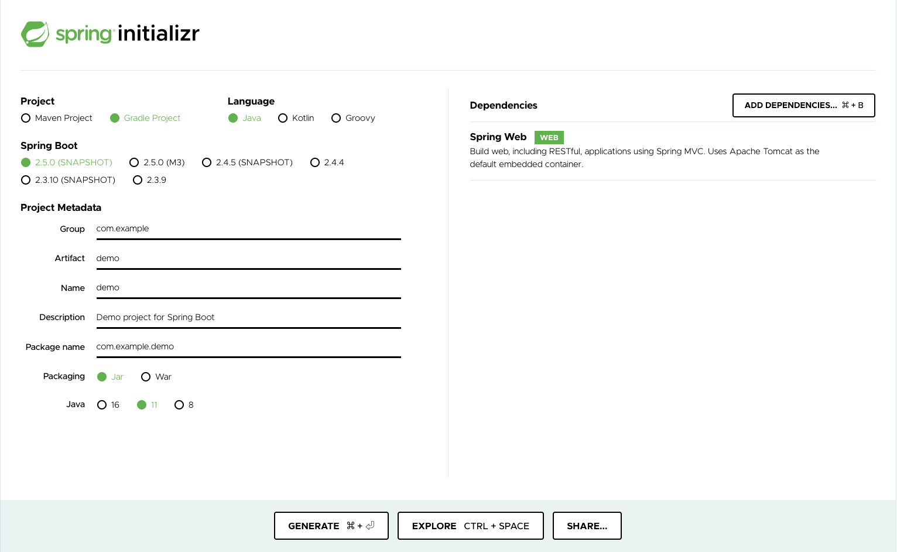

# Spring Boot


# メモ

以下でソースコードを作成 (2021/03/24)
https://start.spring.io/
---> これで demo.zip を作成

https://spring.io/guides/gs/spring-boot/



## 実際にやってみる

+ Create Docker image

```
docker build . --tag my-spring-boot
```

+ Lunch and Login Docker Container

```
docker run -it --rm -v $(pwd):/data/demo -w /data --name my-spring-boot my-spring-boot /bin/bash
```